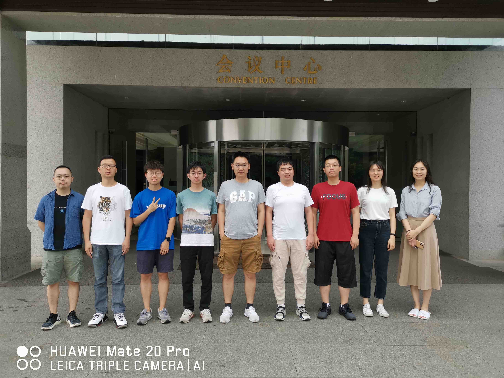
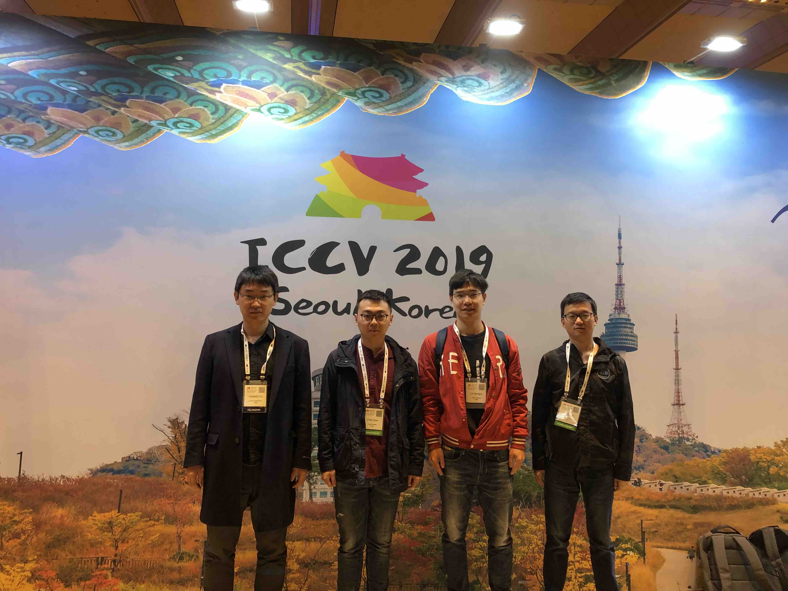
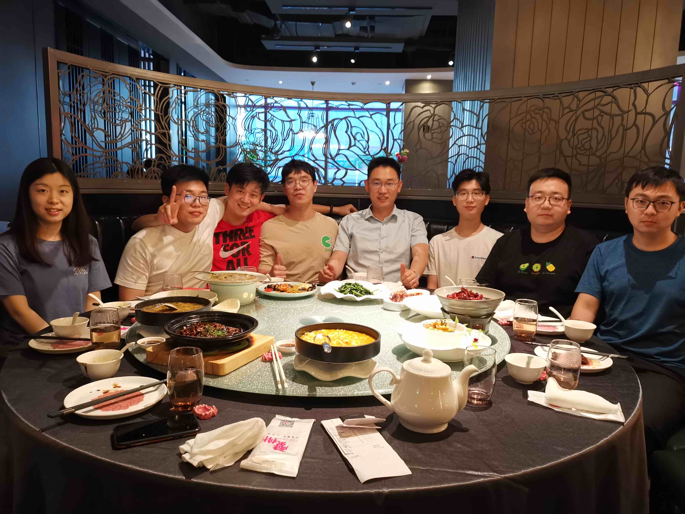
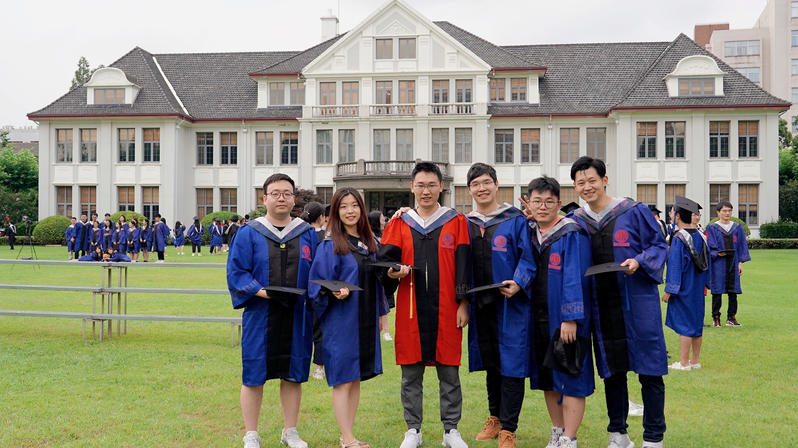
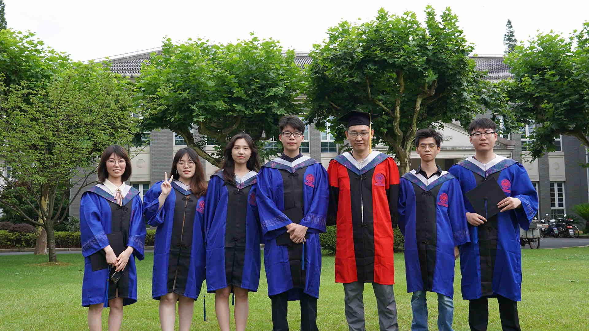

#About the research introduction of our group@SDS-Fudan 
<iframe src="//player.bilibili.com/player.html?aid=988263237&bvid=BV1Y44y1Q7qz&cid=912345802&page=1&high_quality=1" scrolling="no" border="0" frameborder="no" framespacing="0" allowfullscreen="true" width="100%" height="500"> </iframe> 

## Honary Awards of Students
Undergraduates:

Hangyu Lin: 上海市优秀本科毕业生
Hanze Dong: 复旦大学优秀毕业生

Masters&PhD:
Hangyu Lin: 上海市优秀毕业生
Yu Hao: 上海市优秀毕业生
Xingkui Wei: 上海市优秀毕业生
Chen Liu: 上海市优秀毕业生
Wenxuan Wang: 上海市优秀毕业生

## Graduate Students
* 2022 Master of Science
   
   Yongchong Gu

   Lingjie Kong

* 2021 Master of Science

   Jingshi Lei
   
* 2020 Master of Science

   Yuxin Hong
   
   Xiang Li
   
   Yun He ( co-advised with Prof. Xiangyang Xue)
   
* 2019 Master of Science
   Wenhui Han (Master 2019): Tecent Yutu Lab<
   
   Zuyuan Zhong (Master 2019):  广东省发改委
   
   JianAn Wang (Master 2019): Bytedance
   
   Xingkui Wei (Master 2019, co-advised with Prof. Xiangyang Xue): Netease, with amazing high salary package
   
   Chengrong Wang (Master 2019, co-advised with Prof. Xiangyang Xue): 上海市人社局
   
* 2018 Master of Science
   
   Hangyu Lin (Master 2018), Guangying Lab in Tecent. He is awarded the HongKong PhD Fellowship, pursuing PhD in HKUST.
   
   Erli Ouhyang (Master 2018), Tecent
   
   Fangrui Zhu (Master 2018),  PhD@Northeastern University with Prof. Haizu Jiang
   
   Chao Wen (Master 2018, co-advised with Prof. Xiangyang Xue), Toutiao
   
   Sixiao Zheng (Master 2018, co-advised with Prof. Jianfeng Feng), Tecent
   
   Yuming Sun (Master 2018, co-advised with Prof. Xiangyang Xue), Toutiao
   
   Chen Liu (Master 2018, co-advised with Prof. Xiangyang Xue), PHD@HKUST with Prof. Yuan Yao, with the support of HongKong PhD Fellowship, and Redbird PhD Scholarship of HKUST
   
   Yu Hao (M.S. 2016, co-advised with Prof. Yu-Gang Jiang): toutiao
   
* 2017 Master of Science

   Keke He (Master 2015, co-advised with Prof. Xiangyang Xue), Tencent Youtu Lab
   
   Changmao Cheng (M.S. 2016, co-advised with Prof. Yu-Gang Jiang) At Megvii
   
* PhD:

  Yizhuo Ding (PhD 2022, School of Data Science)
  
  Qiaole Dong (PhD 2022, School of Data Science)
  
  Ke Fan (PhD 2021, School of Data Science)
  
  Chenjie Cao (PhD 2020, School of Data Science) 
  
  Boyan Jiang (PhD 2019, School of Computer Science, co-advised with Prof. Xiangyang Xue)
  
  Yuqian Fu (PhD 2019, School of Computer Science, co-advised with Prof. Yugang Jiang)
  
  Haitao Lin (PhD 2019, School of Computer Science,  co-advised with Prof. Xiangyang Xue)
  
  Yikai Wang (PhD 2019, School of Data Science)
  
  Chengming Xu (PhD 2018, School of Data Science)
  
  Xu Xie (PhD 2018, School of Data Science)
  
  Qiang Sun (Ph. Eng. 2018, School of Engeering, co-advised with Prof. Xiangyang Xue)
  
* PhD in ISTBI:

  Yong Wu (PhD 2021), mainly advised by Dr. Xinwei Sun
  
  Hanjia Liu (PhD 2021), mainly advised by Dr. Xinwei Sun
  
  Jianxing Gao (PhD 2022)
  
  Jingyang Huo (PhD 2022)
  
  Tianyu Wang (PhD 2022)
  
-------------------------------------------------------------

* Visiting PhD Student to Our Lab

  2019.04-2019.09 Satoshi Tsutsui, PhD of Indian University (Supervisor: David Crandall): Post-doc in Singapore
  
  2020.11 - 2021.09 Pan Li, PhD of Queen Mary University of London (Supervisor: Shaogang Gong)
  
  2020.10 - 2021.02 Xueting Zhang, PhD from Edinburgh University (Supervisor: Timothy Hospedales)
  
* Alumni of PhD.

  2022:
  
  Hang Yu (PhD 2019-2022 co-advised with Prof. Yugang Jiang ): Shanghai Lianying Intelligent Medical Technology Co., Ltd.
  
  Wenxuan Wang (PhD 2016-2022, co-advised with Prof. Xiangyang Xue): Intel lab, shanghai
  
  2021: 
  
  Xuelin Qian (PhD 2015-2021, co-advised with Prof. Xiangyang Xue): Post-doc in Fudan
  
  Xiaomei Wang (PhD 2017-2021,co-advised with Prof. Xiangyang Xue):Shanghai Deying Date Technology Co.,Ltd.
  
* Undergraduates

  2022
  
  Ziqi Zhou
  
  Zirui Liu
  
  2021
  
  Simian Luo (Undergraduate, School of Data Science): PhD@清华大学交叉信息研究院, with Dr. 赵行
  
  2020
  
  Jiashun Wang (Undergraduate, School of Data Science): PhD@CMU with Jessica Hodgins
  
  Tingjia Cao (Undergraduate, School of Computer Science):  PhD UW-Madison
  
  Ke Han (Undergraduate, School of Computer Science): PhD Purdue University
  
  2019
  
  Zitian Chen( Bsc 2015 Undergraduate, School of Computer Science): PHD in UMass
  
  2018
  
  Hanze Dong (Bsc 2015,  School of Data Science): PHD@HKUST with Prof. Tong Zhang
  
  Peng Lu (Bsc 2015, School of Data Science ): Master in US
  
  Donghao Li (Bsc 2015 ): PHD@HKUST with Prof. Yuan Yao
  
  Binghui Xie (Undergraduate): PhD  in NUS
  
  Guoyun Tu( Undergradudate): Master in KTH Royal Instittue of Technology
  
  2017
  
  Weidong Yin (Undergraduate), PhD/Master at UBC with Leonid Sigal
  
  Yiqing Ma (Undergraduate), PhD at HKUST
  
  Jiarui Gao (Undergraduate), Master at CMU
  
  Chuanzi He (Undergraduate), Master at USC
  
* Masters of  Engineering 

  2019:
  
  Fangbin Wan (M. Eng 2018), 
  
  Jing Lin (M. Eng 2017), 
  
  Yihao Xu (M. Eng 2017), 
  
  Zhexun Yi (M. Eng 2017) 
  
  2018:
  
  Chen Chen (M. Eng 2018)
  
  Xiangyu Fan(M. Eng 2018)
  
  Wei Li (M. Eng 2018)
  
  Chunming Zhao (M. Eng 2018)
  
  Chen Zhan  (M. Eng 2018)
  
  Yulu Xu  (M. Eng 2018)
  
  Yantan Han  (M. Eng 2018)
  
  Yuhao Chen  (M. Eng 2018)
  
  2017:
  
  Nanyang Wang (M. Eng 2017, co-advised with Prof. Yu-Gang Jiang) At Alibaba Dharma
  
  Huiyuan Zhuo (M. Eng 2017), 
  
  Ping Chen (M. Eng 2017), 
  
  Haitao Hu(M. Eng 2017) ,
  
  Yu Tang (M. Eng 2017), 
  
  Weicheng Zhu (M. Eng 2017), 
  
  Weiqi Fang (M. Eng 2017), 
  
  Zhiquan Yan (M. Eng 2017), 
  
  Zihao Xu (M. Eng 2017), 
  
  Hangchu Guo (M. Eng 2017),
  
  Jing Zhou (M. Eng 2017),

My Group Photos:

Master of Science, 2018

Master of Engineering, 2019

